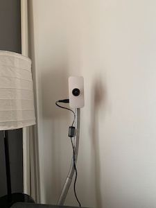

# Raspberry Pi Zero W as Home Security Camera

This document list steps to setup a raspberry pi zero W as a home security camera using the [motion package](https://motion-project.github.io).

All the webpage references and dependencies reflect the status as of December 2019 - Feburary 2020.

The fully assembled camera (with the official case, a wide angle lense and a stand attached with magnet):

  

## Prepare Raspberry Pi for Headless Setup
- Image sd card following Raspberry Pi official instruction [here](https://www.raspberrypi.org/documentation/installation/installing-images/README.md) by downloading file and imaging it into the sd card (with `dd` tool if using Mac/Linux).
  - It is reported in various forums that the quality of SD card affects system stability, however a cheap 16G card from a dollar store worked just fine in my setup (at least for 4 months at the time of this writing).

- Enable SSH by placing a empty file named “ssh” (without any extension) onto the boot partition of the SD card.

- To be able to connect to WIFI at first boot, put a `wpa_supplicant.conf` file in the boot partition (official instruction [here](https://www.raspberrypi.org/documentation/configuration/wireless/headless.md))

    ```
    ctrl_interface=DIR=/var/run/wpa_supplicant GROUP=netdev
    update_config=1
    country=<Insert 2 letter ISO 3166-1 country code here>

    network={
    ssid="<Name of your wireless LAN>"
    psk="<Password for your wireless LAN>"
    }
    ```

- After first boot, wait a few minutes and go to your router's DHCP client list to find the ip address of the new rpi system. A static client can be set up to ensure the same local IP for the pi.

- `ssh` into the system using the [default username/password](https://www.raspberrypi.org/documentation/linux/usage/users.md) `pi:raspberry`. Best practise is to change the username and password once you login.

## Install and Configure Motion 

Refer to instructions [here](https://motion-project.github.io/motion_config.html#basic_setup_picam)

```
sudo apt-get update
sudo apt-get dist-upgrade -y
sudo apt-get install motion
sudo modprobe bcm2835-v4l2
```

Update motion config at `/etc/motion/motion.conf`. Some important fields are:
  - `daemon on` to enable it as a service and start automatically everytime system boot.
  - Adjust image `width`, `height` and `framerate`. More CPU/RAM usage will be needed for higher resolution and frame rate. `960*720` and default framerate of `2` are good starting point.
  - `stream_port`, `stream_maxrate`, for streaming configuration.
  - `stream_localhost off` and `stream_auth_method` to enable and secure access from other devices.
  - `webcontrol_port`, etc. to configure the control webportal access.

If motion detection (the ability to save to files or take actions once a motion is detected) is not desired (`output_pictures off` and `ffmpeg_output_movies off`), it can be disabled to save a fair amount of CPU resource:
  - Mannually disable in the control webportal
  - Disabl automatically at start time by changing motion service start script (`/etc/init.d/motion`): At the line where it start the service: add the `-m` option, e.g. `start-stop-daemon --start --oknodo --exec $DAEMON -b --chuid motion -- -m ;`

Restart motion: `sudo service motion restart`

Open a browser in a device in your local network and visit `ip:port` with the value of your configuration.

## Optional System Configuration for Stability and Convenience


1. Disable the wifi power management to make wifi always online

    Run the following or add them to `/etc/rc.local` to configure at every system boot.

    ```
    sudo iwconfig wlan0 power off
    sudo iwconfig wlan0 channel auto
    sudo iwconfig wlan0 txpower auto
    ```

2. Configure router port forwarding to enable access from outside of your local network.

3. Handle IP address change.

    Most home internet providers do not guarentee consistent public IP to your home router. Instead of using a dynamic DNS service, an alternative is to run a periodic job to check public ip and send out notification when there's a new public ip.

    - Pull [`update.sh`](update.sh) to a local folder and change its line 43 to your way of notification. For example, POST to a slack web hook that sends a slack message. The script also serves as a monitor of internet connection by calling [ipify](https://www.ipify.org/) service.

    - Run `crontab -e` and add following line to the end to run `update.sh` every 5 minutes:

    ```
    */5 * * * * /path/to/update.sh >/dev/null 2>&1
    ```

    To check if cron service is active in your system, use `service cron status` or `journalctl -u cron` to check cron job log.

4. Lower cpu clock speed 

    It is [reported](https://www.youtube.com/watch?v=zp1Eq_pY0Rw) that if running at default speed, i.e. 1GHz for pi zero/W, the system can be unstable and have intermittent kernel errors. So it is a good practise to lower the clock speed by change the config file at `/boot/config.txt`:

    ```
    arm_freq=800
    ```